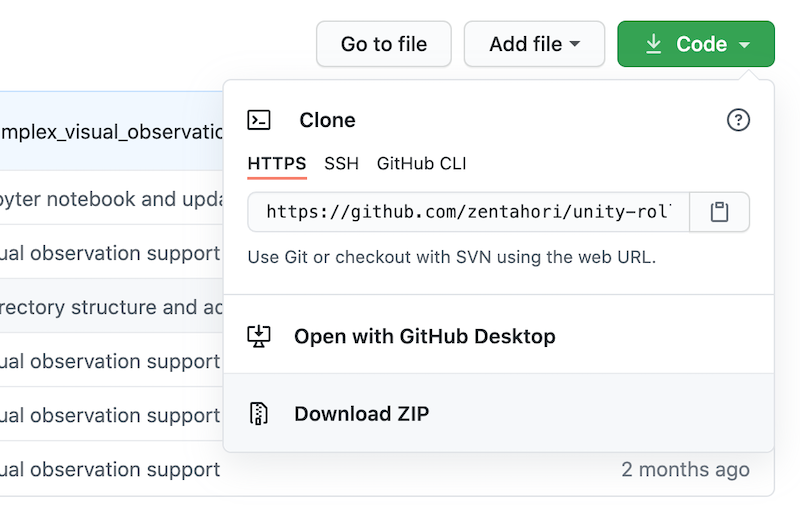

# unity-roller-ball-simulation
This is a sample unity project for Unity Game Simulation with ML-Agents running on Amazon SageMaker RL.

## Preparation
### Download this repo

First, download a zip file from the repo and open it. 
You will find a folder called **unity-roller-ball-simulation-master**.

### Unity

Start **Unity Hub**. In **Projects** window, press **Add** and select **RollerBall** folder in the folder described above. 

Next, we want the set up scene to play correctly when the training process
launches our environment executable. This means:

- The environment application runs in the background.
- No dialogs require interaction.
- The correct scene loads automatically.

1. Open Player Settings (menu: **Edit** > **Project Settings** > **Player**).
1. Under **Resolution and Presentation**:
   - Ensure that **Run in Background** is Checked.
   - Ensure that **Display Resolution Dialog** is set to Disabled. (Note: this
    setting may not be available in newer versions of the editor.)
1. Open the Build Settings window (menu:**File** > **Build Settings**).
1. Choose your target platform.
   - (optional) Select “Development Build” to
     [log debug messages](https://docs.unity3d.com/Manual/LogFiles.html).
1. If any scenes are shown in the **Scenes in Build** list, make sure that the
   3DBall Scene is the only one checked. (If the list is empty, then only the
   current scene is included in the build).
1. Click **Build**:
   - In the File dialog, navigate to your ML-Agents directory.
   - Assign a file name and click **Save**.
   - (For Windows）With Unity 2018.1, it will ask you to select a folder instead
     of a file name. Create a subfolder within the root directory and select
     that folder to build. In the following steps you will refer to this
     subfolder's name as `env_name`. You cannot create builds in the Assets
     folder

Now that we have a Unity executable containing the simulation environment, we
can interact with it.
