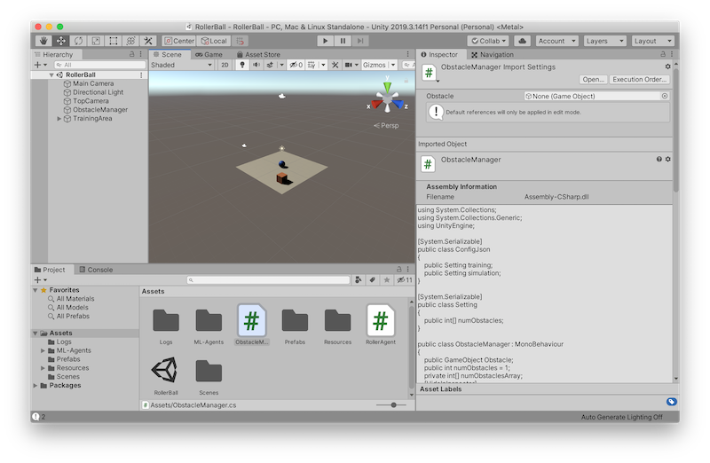
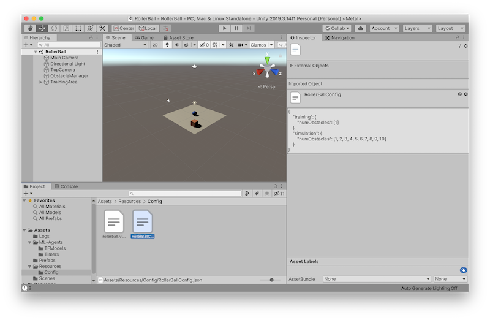

# unity-roller-ball-simulation
This is a sample unity project for Unity Game Simulation with ML-Agents running on Amazon SageMaker RL.

## Preparation
### Download this repo
First, download a zip file from the repo and open it. 

You will find a folder called **unity-roller-ball-simulation-master**.

### Unity
Start **Unity Hub**. In **Projects** window, press **Add** and select **RollerBall** folder in the folder described above. 

You may need to download the version 2019.3.14.f1 version of Unity with Linux support module. 

This is how the sample game, **RollerBall** looks like. 

There are three important scripts, ObstacleManager.cs, RollerAgent.cs, and RollerBallConfig.json.

RollerBallConfig.json is found in Resources/Congig/. 

### Build the project for Linux platform
Open Player Settings (menu: **Edit** > **Project Settings** > **Player**).

Under **Resolution and Presentation**:
   - Ensure that **Run in Background** is checked.

Open the Build Settings window (menu:**File** > **Build Settings**).

Select **Linux** as Target Platform 
   - (Optional) **Development Build** is checked. 

Press **Build And Run**

We name the sample collection of built files as **RollerBall_build_000**.

Here is how the built files look like in the **RollerBall** folder. 

Upload built files to S3. 

