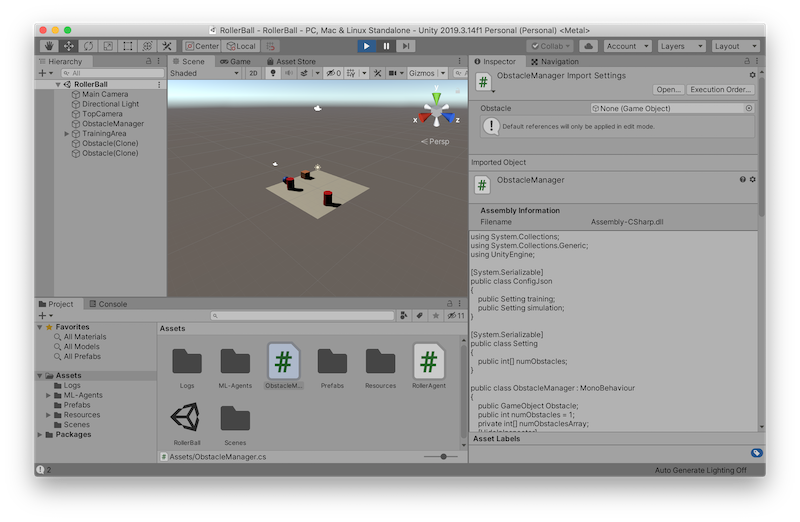
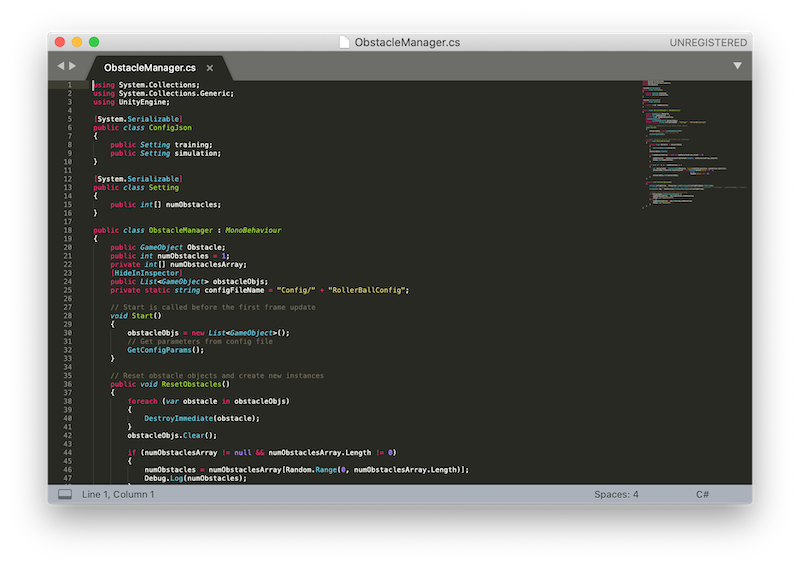
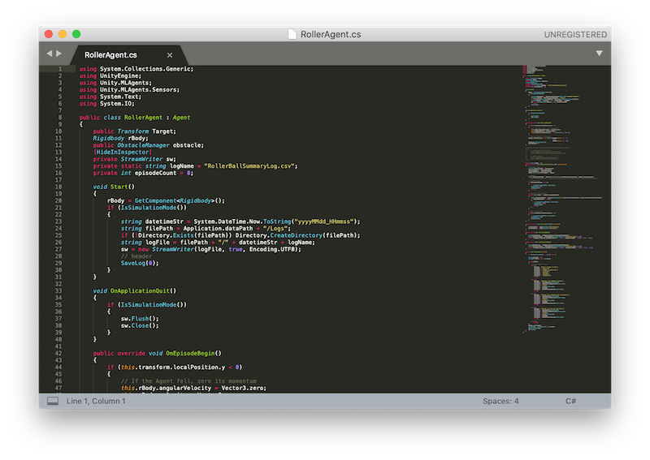

# unity-roller-ball-simulation
This is a sample unity project for Unity Game Simulation with ML-Agents running on Amazon SageMaker RL.

## Preparation
### Download this repo
First, download a zip file from the repo and open it. 


You will find a folder called **unity-roller-ball-simulation-master**.

### Unity
Start **Unity Hub**. In **Projects** window, press **Add** and select **RollerBall** folder in the folder described above. 


You may need to download the version 2019.3.14.f1 version of Unity with Linux support module. 

This is how the sample game, **RollerBall** looks like. 




There are three important scripts, ObstacleManager.cs, RollerAgent.cs, and RollerBallConfig.json.





RollerBallConfig.json is found in Resources/Congig/. 


### Build the project for Linux platform
Open Player Settings (menu: **Edit** > **Project Settings** > **Player**).

Under **Resolution and Presentation**:
   - Ensure that **Run in Background** is checked.

Open the Build Settings window (menu:**File** > **Build Settings**).

Select **Linux** as Target Platform 
   - (Optional) **Development Build** is checked. 


Press **Build And Run**


We name a collection of built files as **RollerBall_build_000**.

Here is how the built files look like in the **RollerBall** folder. 


Copy the flowing files and folder and upload them to S3. 
   - LinuxPlayer_s.debug	
   - RollerBall_build_000_Data/	
   - RollerBall_build_000.x86_64	
   - UnityPlayer_s.debug	
   - UnityPlayer.so


Please take note of S3 URI. You are going to need that for **rl_unity_cloud_simulation_sample.ipynb** 

## Amazon SageMaker RL
### Amazon SageMaker RL on SageMaker notebook
Start **Amazon SageMaker** and create **Notebook Instance**. (menu:**Notebook** > **Notebook instance** > **Create notebook instance**).
   - t3.xlarge instance is adequate. 
	
Click **Open Jupyter** and select **SageMaker Examples**

SageMaker provides dozens of sample notebooks. You can find a samle notebook named **rl_unity_ray** under **Reinforcement Learning** tab. 


Select **rl_unity_ray** and create a directry.

```
/home/ec2-user/SageMaker/rl_unity_ray_YYYY-MM-DD
```

Go to **rl_unity_ray_YYYY-MM-DD**


Upload following files from the original repo.
   - rl_unity_cloud_simulation_sample.ipynb
   - src/evaluate-unity.py
   - src/train-unity.py

### Proceed rl_unity_cloud_simulation_sample.ipynb


